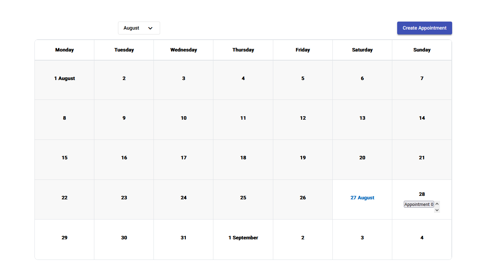

# A Doctors Appointment App in Angular



Live demo of the project can be found here https://idyllic-kulfi-10fe5b.netlify.app/

## Angular version
 * This project is created with [Angular CLI](https://github.com/angular/angular-cli) version 13.1.2.
## Other Packages
* [Angular Material](https://material.angular.io/)
* [Angular Material Timepicker](https://tonysamperi.github.io/ngx-mat-timepicker/)


## A short brief
### Modules
* Components : For storing all the componets of the project
* Shared :     For storing the reusable components, custom pipes pipes
* Utils :      For storing the models and utility functions

### Services
 * AppoinmentService have been used for sharing data to multiple componets.

### Styling 
* For styling Scss and Angualar Material is used.

### Storind Data
 * For storing app data browsers localstorage have been used in this project

## Get started

### Clone the repo


Create a directory with your desired name and clone it there.

```shell
git clone https://github.com/apurbahasan1994/Front-end-Assesment.git
```

### Install npm packages and start the dev server


Install all the despendencies described in the `package.json` and verify that it works:

```shell
npm install
ng serve
```
Navigate to `http://localhost:4200/`. The app will automatically reload if you change any of the source files.


# Build

Run `ng build` to build the project. The build artifacts will be stored in the `dist/` directory.
